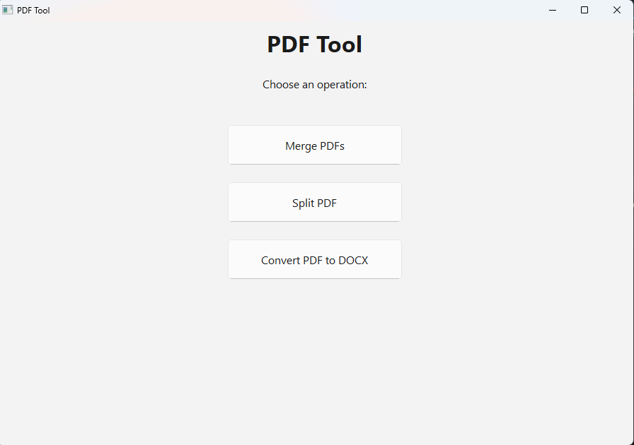

# PDF Tool

A lightweight desktop utility for managing PDF files with an intuitive menu-driven interface.



## Features

- **Merge PDFs** - Combine multiple PDF files with drag & drop support and thumbnail previews
- **Split PDF** - Extract page ranges with visual page previews
- **Convert to DOCX** - Transform PDF files to Word documents
- **Drag to Reorder** - Rearrange PDFs in merge list by dragging
- **PDF Previews** - See thumbnail previews before processing
- **Menu-driven UI** - Clean, focused interface for each operation
- Native desktop UI (PySide6 / Qt)
- Packaged as a Windows `.exe` with PyInstaller

## Tech Documentation 

- Python 3.x
- [PyMuPDF](https://pymupdf.readthedocs.io/) for PDF manipulation and thumbnail generation
- [pdf2docx](https://github.com/ArtifexSoftware/pdf2docx) for PDF to DOCX conversion
- [PySide6](https://doc.qt.io/qtforpython/) for the GUI
- [PyInstaller](https://pyinstaller.org/) for packaging

## Installation

1. Clone the repository:
   ```bash
   git clone https://github.com/yourusername/pdf-editor.git
   cd pdf-editor
   ```

2. Install dependencies:
   ```bash
   pip install -r requirements.txt
   ```

3. Run the application:
   ```bash
   python app/main.py
   ```

## Usage

1. Launch the application
2. Choose an operation from the main menu:
   - **Merge PDFs**: Add multiple PDFs, drag to reorder, then merge
   - **Split PDF**: Select a PDF, choose page range, then split
   - **Convert to DOCX**: Select a PDF and convert to Word format

## Project Structure

.venv/
app/
  main.py        # Entry point
  ui.py          # GUI layout + event handlers
  pdf_engine.py  # PDF logic (merge + split)
  utils.py       # Helper functions

## Developer

Name: Justin Carter
Email: Justincarter429@gmail.com || 1619054@umail.utah.edu
School: University of Utah